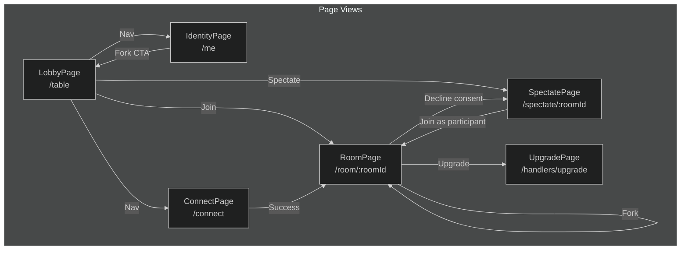
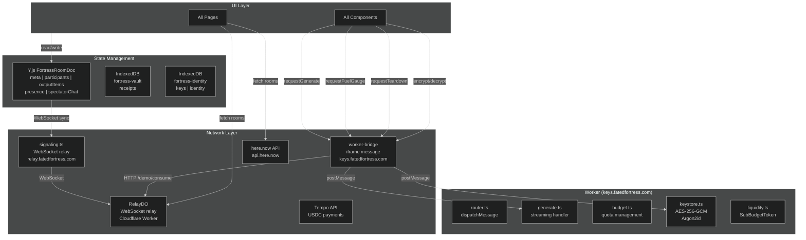

# Fortress UI Architecture — Stitch Compatible

Complete UI specification for Stitch (Google AI UI generation).

---

## Design System

```
Font: Iosevka (monospace)
Color Palette:
  --ff-black:        #0a0a0a
  --ff-white:        #fafafa
  --ff-gray-50:      #f5f5f5
  --ff-gray-100:     #e5e5e5
  --ff-gray-200:     #d4d4d4
  --ff-gray-300:     #a3a3a3
  --ff-gray-400:     #737373
  --ff-gray-500:     #525252
  --ff-gray-600:     #404040
  --ff-gray-700:     #262626
  --ff-gray-800:     #171717
  --ff-accent:       #22c55e (green-500)
  --ff-accent-hover: #16a34a
  --ff-danger:       #ef4444
  --ff-warning:      #f59e0b
  --ff-info:         #3b82f6

Spacing Scale: 4px base (4, 8, 12, 16, 20, 24, 32, 40, 48, 64)
Border Radius: 4px (sm), 8px (md), 12px (lg), 16px (xl)
Shadows:
  --shadow-sm: 0 1px 2px rgba(0,0,0,0.05)
  --shadow-md: 0 4px 6px -1px rgba(0,0,0,0.1)
  --shadow-lg: 0 10px 15px -3px rgba(0,0,0,0.1)

Presence State Colors:
  active:      #22c55e (green)
  idle:        #eab308 (yellow)
  away:        #f97316 (orange)
  generating:  #3b82f6 (blue, pulsing)
  error:       #ef4444 (red)
  disconnected:#6b7280 (gray)

Connection Badge Colors:
  connecting: #94a3b8 (slate)
  p2p:        #22c55e (green)
  turn:       #eab308 (yellow)
  failed:     #ef4444 (red)

Demo Banner: rgba(0,0,0,0.72) bg, #c8f59a link color
Output Pane (terminal): #0d0d0d bg, #c8f59a text (green terminal)
```

---

## Page Structure

```
App
├── / (redirects to /table)
├── /table           [LobbyPage]
├── /room/:roomId    [RoomPage]
├── /spectate/:roomId [SpectatePage]
├── /me              [IdentityPage]
├── /connect         [ConnectPage]
└── /handlers/upgrade [UpgradePage]
```

---

## Component Hierarchy — Full Tree

```
App
└── Router
    │
    ├── LobbyPage (/table)
    │   └── LobbyContainer
    │       ├── Header
    │       │   ├── Logo ("FATED FORTRESS")
    │       │   ├── NavLink (to="/me")
    │       │   └── ThemeToggle
    │       ├── RoomGrid
    │       │   └── RoomCard (×N)
    │       │       ├── RoomCardHeader
    │       │       │   ├── CategoryGlyph (badge)
    │       │       │   └── RoomCardTitle (name)
    │       │       ├── RoomCardMeta
    │       │       │   ├── HostName ("by anon_...")
    │       │       │   └── PriceBadge ("FREE" | "$0.50")
    │       │       ├── FuelGaugeMini
    │       │       │   ├── FuelMiniBar
    │       │       │   └── FuelMiniFill (width %)
    │       │       ├── ParticipantCount ("N participants · M spectating")
    │       │       └── RoomCardActions
    │       │           ├── JoinButton → /room/:roomId
    │       │           └── SpectateButton → /spectate/:roomId
    │       ├── HereNowFeed
    │       │   └── HereNowCard (×N, from here.now API)
    │       │       ├── HereNowTitle
    │       │       └── HereNowMeta
    │       └── EmptyState (when no rooms)
    │           ├── EmptyStateIcon
    │           └── CreateRoomCTA
    │
    ├── RoomPage (/room/:roomId)
    │   └── RoomContainer
    │       ├── DemoKeyBanner (conditional — demo mode)
    │       │   ├── BannerIcon (◍)
    │       │   ├── BannerText ("You're on a demo key · N tokens · expires HH:MM")
    │       │   ├── ConnectYourKeyCTA ("Connect your key →")
    │       │   └── BannerDismiss (×)
    │       ├── KeyPromptBanner (conditional — blocked)
    │       │   ├── BannerIcon (⚠)
    │       │   ├── BannerText (reason message)
    │       │   └── ConnectKeyLink → /connect
    │       ├── ConnectionBadge
    │       │   ├── Dot (⏳/🟢/🟡/🔴)
    │       │   └── Label (CONNECTING/P2P/TURN/OFFLINE)
    │       │   States: connecting | p2p | turn | failed
    │       ├── PresenceBar
    │       │   └── PresenceAvatar (×N, max 8)
    │       │       ├── AvatarSvg (deterministic from avatarSeed)
    │       │       ├── Initials (2-letter)
    │       │       └── StateDot (colored by presence state)
    │       │           States: active | idle | away | generating | error | disconnected
    │       ├── OutputPane
    │       │   ├── OutputContent
    │       │   │   ├── TextOutputItem (×N, <pre> with terminal green text)
    │       │   │   ├── ImageOutputItem (×N)
    │       │   │   │   ├── Img (lazy loaded)
    │       │   │   │   ├── DownloadButton (↓)
    │       │   │   │   └── UseAsReferenceButton (↗)
    │       │   │   ├── AudioOutputItem (×N, <audio controls>)
    │       │   │   └── OutputPlaceholder ("Waiting for generation...")
    │       │   └── OutputActions
    │       │       ├── CopyButton
    │       │       └── ClearButton
    │       ├── ControlPane (NOT rendered for spectators)
    │       │   ├── DemoBanner (conditional)
    │       │   │   ├── DemoBannerText
    │       │   │   ├── DemoBannerLink → /connect
    │       │   │   └── DemoBannerDismiss (×)
    │       │   ├── ModelSelector
    │       │   │   └── SelectorDropdown
    │       │   │       └── ModelOption (×N)
    │       │   │           openai/gpt-4o · OpenAI o3 · OpenAI o4-mini
    │       │   │           anthropic/claude-4-sonnet · claude-4-opus · claude-haiku
    │       │   │           google/gemini-2.0-flash · gemini-2.0-pro
    │       │   │           groq/llama-3.3-70b · groq/mixtral-8x7b
    │       │   │           openrouter/auto
    │       │   ├── SystemPromptInput (textarea, optional)
    │       │   ├── ImageExtras (only when roomType === "image")
    │       │   │   ├── AspectRatioChips (1:1 · 16:9 · 9:16 · 4:3 · 3:4)
    │       │   │   ├── NegativePromptInput (textarea)
    │       │   │   ├── SeedInput (number, 0 = random)
    │       │   │   └── StylePresetsSelect (None · Photorealistic · Illustration · Digital Art · Anime · Watercolor · Pixel Art)
    │       │   ├── PromptInput (textarea)
    │       │   │   └── Ctrl+Enter shortcut to generate
    │       │   ├── GenerateButton
    │       │   │   └── States: default ("GENERATE") | loading ("STOP") | disabled
    │       │   ├── AbortButton (visible during generation)
    │       │   ├── TemplatesList (conditional, max 5 shown)
    │       │   │   └── TemplateButton (×N, fills prompt on click)
    │       │   └── FuelGaugeInline
    │       │       ├── FuelBar
    │       │       ├── FuelFill (width %)
    │       │       └── FuelLabel ("N participant(s) · X% fuel")
    │       ├── ReceiptPanel (collapsible)
    │       │   ├── ReceiptPanelHeader
    │       │   │   ├── ReceiptPanelTitle ("Receipt")
    │       │   │   └── ReceiptPanelToggle (chevron)
    │       │   └── ReceiptList
    │       │       └── ReceiptCard (×N)
    │       │           ├── ReceiptCardHeader
    │       │           │   ├── ReceiptModel (icon + name)
    │       │           │   ├── ReceiptTimestamp
    │       │           │   └── ReceiptPrice (ETH)
    │       │           ├── ReceiptPrompt (truncated, max 200 chars)
    │       │           ├── ForkTree (ASCII tree lines)
    │       │           │   └── ForkLine (×N)
    │       │           └── ReceiptActions
    │       │               ├── ForkButton → /room?seed={receiptId}
    │       │               └── CopyButton
    │       ├── SpectatorChat (only for spectators)
    │       │   ├── ChatViewer (scrollable message list)
    │       │   │   └── ChatMessage (×N)
    │       │   │       ├── MessageTimestamp
    │       │   │       ├── MessageDisplayName (@name)
    │       │   │       ├── MessageText
    │       │   │       └── DeletedClass (when isDeleted)
    │       │   └── ChatInput (Enter to send)
    │       │       └── SendButton
    │       └── RoomHeader
    │           ├── RoomTitle
    │           ├── SpectatorBadge ("SPECTATING", conditional)
    │           ├── HostSettingsTrigger (⚙, host-only)
    │           │   └── HostSettingsPanel (popover)
    │           │       ├── RoomNameInput
    │           │       ├── DescriptionTextarea
    │           │       ├── VisibilitySelect (public | private)
    │           │       ├── CommunityKeysToggle (checkbox)
    │           │       └── SaveButton
    │           └── LeaveButton ("LEAVE")
    │
    ├── SpectatePage (/spectate/:roomId)
    │   └── SpectateContainer
    │       ├── ConnectionBadge
    │       ├── PresenceBar
    │       ├── OutputPane (same as RoomPage)
    │       ├── SpectatorChat (same as RoomPage)
    │       ├── SpectatorBanner ("You are spectating — your messages only reach other spectators.")
    │       └── BackButton (→ /table)
    │
    ├── IdentityPage (/me)
    │   └── IdentityContainer
    │       ├── Header
    │       ├── IdentityCard
    │       │   ├── AvatarDisplay (deterministic SVG from pubkey)
    │       │   ├── PubkeyDisplay (truncated, copy button)
    │       │   ├── DisplayNameInput
    │       │   └── ExportDropdown
    │       │       ├── ExportJSON
    │       │       ├── ExportQR
    │       │       └── ImportButton
    │       ├── ReceiptVault
    │       │   ├── VaultHeader
    │       │   │   ├── VaultTitle ("Receipt Vault")
    │       │   │   └── VaultCount (total receipts)
    │       │   ├── VaultGrid
    │       │   │   └── ReceiptCard (×N)
    │       │   └── VaultEmpty
    │       └── ForkCTA
    │           ├── CTAIcon
    │           └── CTAText + CTAButton → /table
    │
    ├── ConnectPage (/connect)
    │   └── ConnectContainer
    │       ├── Header
    │       ├── ProviderGrid
    │       │   └── ProviderCard (×N)
    │       │       ├── ProviderIcon
    │       │       ├── ProviderName
    │       │       ├── APIKeyInput
    │       │       │   ├── InputField (password type)
    │       │       │   ├── InputToggle (show/hide)
    │       │       │   └── InputStatus (validating spinner)
    │       │       ├── TestResult
    │       │       │   ├── SuccessIcon (✓)
    │       │       │   └── ErrorMessage
    │       │       └── SaveButton
    │       └── HelpText
    │
    └── UpgradePage (/handlers/upgrade)
        └── UpgradeContainer
            ├── UpgradeHeader
            ├── PlanCard
            │   ├── PlanName
            │   ├── PlanPrice
            │   └── PlanFeatures (list)
            ├── PaymentForm
            │   ├── EmailInput
            │   ├── CardInput (Stripe Elements)
            │   └── SubmitButton
            └── BackButton (→ /table)
```

---

## Shared Components

### Button
```
States: default, hover, active, disabled, loading
Variants:
  - primary:   bg=#0a0a0a, text=#fff
  - secondary: bg=#fff, text=#0a0a0a, border 2px #0a0a0a
  - danger:    bg=#9a1818, text=#fff
  - ghost:     bg=transparent, text=#737373
  - streaming: bg=#9a1818, text=#fff (STOP state)
Sizes: sm (32px h), md (40px h), lg (48px h)
Props: leftIcon?, rightIcon?, loading?, disabled?, variant, size
```

### Input / Textarea
```
States: default, focus, error, disabled
Variants: text, password (with toggle), textarea
Props: label?, placeholder, error?, disabled?, type
Features: password eye toggle, character count
```

### Card
```
Props: interactive? (hover lift + shadow), padding
Slots: header?, content, footer?
```

### Modal
```
States: open, closed
Props: title, size (sm/md/lg/xl), closable?
Slots: header, content, footer
Behavior: backdrop click to close (if closable), ESC to close
```

### Dropdown / Select
```
States: closed, open
Props: trigger, placement
Slots: trigger, content, item
Features: keyboard nav, typeahead
```

### Toast / Banner
```
Variants: success, error, warning, info, status, alert
Props: message, duration (auto-dismiss 5s default), action?
Behavior: stacks bottom-right, auto-dismiss
Examples:
  - upgrade-banner: full-width, top of page
  - ff-demo-banner: sticky bottom or top, role=status
  - ff-consent-modal: centered modal with backdrop
```

### Skeleton
```
Props: variant (text|circle|rect), width?, height?, animation (pulse)
Use: loading states
```

### Badge / Chip
```
Variants: default, success, warning, danger, info
Props: children, variant
Chips: active state (chip--active class), clickable
```

### Tooltip
```
Props: content, placement, delay (200ms default)
Behavior: hover/focus to show, mouse-leave/blur to hide
```

### Avatar (PresenceBar)
```
Generation: deterministic SVG from avatarSeed (string hash → hue + shape)
Shapes: circle | rounded-rect | triangle (seed-derived)
Overlays: initials text, state-colored dot
States: default | generating (pulsing dot)
```

---

## User Flows

### Flow: Join Room (Standard)
```
1. User at /table (LobbyPage)
2. User clicks RoomCard JOIN button
3. Navigate to /room/:roomId
4. mountRoom() → joinRoom() → signalingJoin() via WebSocket
5. gateKeyPolicyConsent() — community-key consent modal if needed
6. resolveEntryMode():
   ├── own-key   → has stored API key, proceed
   ├── demo      → no key, demo grant obtained → DemoKeyBanner shown
   └── blocked   → no key + quota exhausted → KeyPromptBanner shown
7. ConnectionBadge polls getStats() every 2s → shows P2P/TURN/CONNECTING
8. upsertPresence() → PresenceBar renders participant avatars
9. If spectator: SpectatorChat + OutputPane (read-only), no ControlPane
   If participant: ControlPane + OutputPane + optional ReceiptPanel
10. Heartbeat: upsertPresence every 5s
```

### Flow: Generate Output (Text)
```
1. User selects model from ModelSelector dropdown
2. User types prompt in PromptInput (Ctrl+Enter shortcut)
3. User clicks GenerateButton
4. handleGenerate():
   a. Check stream cache (getCachedOutput) — prepend if resume
   b. Show AbortButton, hide GenerateButton
   c. bridge.requestGenerate() → iframe → LLM adapter
   d. Stream chunks → appendStreamChunk() (handoff.ts Part B cache)
   e. Each chunk → appendOutput() + appendOutputItem(type="text")
   f. OutputPane observes outputItems Y.Array → re-renders
5. onDone → markStreamComplete() → saveReceipt() (if not demo)
6. GenerateButton restored
7. FuelGauge updates (poll every 5s + ff:fuel event)
```

### Flow: Generate Output (Image)
```
1. User selects "image" modality (roomType === "image")
2. ControlPane shows ImageExtras:
   - AspectRatioChips (1:1, 16:9, 9:16, 4:3, 3:4)
   - NegativePrompt textarea
   - Seed input (0 = random)
   - Style presets dropdown
3. User clicks GenerateButton
4. handleGenerate() passes imageParams to bridge.requestGenerate()
5. onImageUrl(url, alt) → appendOutputItem(type="image")
6. OutputPane: resolves opfs:// URL → blob: URL → renders 
7. Output image has: Download button (↓) + Use as Reference (↗)
   - Download: creates <a download> click
   - Use as Reference: dispatches ff:image-reference event
```

### Flow: Spectate Room
```
1. User clicks RoomCard SPECTATE button
2. Navigate to /spectate/:roomId
3. signalingJoin() with spectate=true flag (relay excludes from signaling)
4. Community-key consent gate (same as join)
5. If declined → mountSpectatorRoom() with spectate=true
   - OutputPane (read-only)
   - SpectatorChat (read/write)
   - "You are spectating" banner
   - No ControlPane (generation disabled)
6. SpectatorChatView subscribes to doc.spectatorChat Y.Array
   - Messages: Y.Map with id, pubkey, displayName, text, ts, type, isDeleted, reactions
   - Enter key sends message
   - Soft-delete support (isDeleted flag)
   - Reactions support (Record<string, pubkey[]>)
7. PresenceBar: isSpectator=true, connectedVia="spectator"
```

### Flow: Fork Receipt
```
1. User at /me (IdentityPage) or /room (ReceiptPanel)
2. User clicks ReceiptCard fork action
3. Navigate to /room?seed={receiptId}
4. Room loads with pre-filled prompt from receipt seed
5. OutputPane shows cached output (from handoff.ts Part B stream cache)
6. User can modify prompt and generate new version
7. New receipt created with fork lineage in ReceiptCard
```

### Flow: Onboarding (3-Step Modal)
```
Trigger: shown once per session on room page if ff_onboarding_done not set
Session key: sessionStorage ff_onboarding_done

Step 1 — Pick your craft:
  - 4 modality cards: Text ✏️, Image 🖼️, Audio 🎵, Video 🎬
  - Each shows label + description + selected state

Step 2 — Auto-play demo (5 second animation):
  - Progress bar fills over 5s
  - Typing cursor blink → "Generating..." spinner → dots animation → "✓ Output ready!"
  - Skip button to proceed early

Step 3 — Try it:
  - Pre-filled prompt based on selected modality
  - Enter to go, Esc to skip
  - Sets ff_onboarding_done session key
  - Calls onComplete(modality, prompt)
```

### Flow: Host Settings
```
Trigger: host clicks ⚙️ icon in room header (only visible to activeHostPubkey)
Panel: settings popover appended to header trigger's parentElement

Controls:
  - Room Name (text input, max 80)
  - Description (textarea, max 500)
  - Visibility (select: public | private)
  - Allow Community Keys (toggle)
    - setAllowCommunityKeys(doc, value)
    - Sets keyPolicyChangedAt timestamp
    - Triggers re-consent for all participants
  - Save button (save button calls doc.doc.transact + setMeta)
```

### Flow: Connection Badge
```
Poll: getPeerConnections() from signaling.ts, every 2000ms
Inspect: pc.iceConnectionState + detectRelay() via getStats()

States:
  connecting: iceConnectionState in {new, checking} → ⏳ CONNECTING
  p2p:       iceConnectionState connected/completed + NOT relay → 🟢 P2P
  turn:      iceConnectionState connected/completed + relay candidate → 🟡 TURN
  failed:    iceConnectionState in {failed, disconnected, closed} → 🔴 OFFLINE

detectRelay():
  1. Find candidate-pair with state=succeeded AND nominated=true
  2. Look up localCandidateId in stats map
  3. Check candidateType === "relay"

Timeout: ff:connection-timeout event ( dispatched after 10s stall)
  → showBanner("Connection is taking longer than expected...")
```

---

## Y.js Document Schema (FortressRoomDoc)

```
doc: Y.Doc (raw, for transport + persistence)
├── meta: Y.Map<RoomMeta>
│   ├── id: RoomId
│   ├── name: string
│   ├── description: string
│   ├── category: RoomCategory
│   ├── access: "free" | "paid"
│   ├── price: number | null
│   ├── currency: "USDC" | null
│   ├── systemPrompt: string
│   ├── createdAt: number
│   ├── schemaVersion: 1
│   ├── upgradedAt: number | null
│   ├── activeHostPubkey: PublicKeyBase58
│   ├── allowCommunityKeys: boolean
│   ├── keyPolicyChangedAt: number
│   ├── roomType: Modality ("text" | "image" | "audio" | "video")
│   └── firstGenerationAt: number | null
├── participants: Y.Map<ParticipantEntry> (keyed by pubkey, replaces legacy Y.Array)
│   ├── pubkey: PublicKeyBase58
│   ├── name: string
│   ├── joinedAt: number
│   ├── contributesKey: boolean
│   ├── quotaPerUser: number | null
│   ├── isSpectator?: boolean
│   └── roles?: RoomRole[]
├── output: Y.Text (legacy — character-level concurrent edits)
├── outputItems: Y.Array<Y.Map> (new — multimodal items)
│   └── [type]: "text" | "image" | "audio"
│       └── text: string | url: string | alt?: string | durationSeconds?: number
├── receiptIds: Y.Array<ReceiptId>
├── templates: Y.Array<string> (JSON-serialized RoomTemplate)
│   └── RoomTemplate: { id, name, systemPrompt, modelRef, category, imageSettings, createdAt }
├── presence: Y.Map<PresenceEntry> (keyed by pubkey)
│   ├── pubkey: PublicKeyBase58
│   ├── name: string
│   ├── cursorOffset: number | null
│   ├── lastSeenAt: number
│   ├── isSpectator?: boolean
│   ├── state: "active" | "idle" | "away" | "generating" | "error" | "disconnected"
│   ├── currentAction: { type: "idle" } | { type: "typing", prompt } | { type: "generating", adapterId, jobId } | ...
│   ├── connectedVia: "p2p" | "relay" | "spectator"
│   └── avatarSeed: string
└── spectatorChat: Y.Array<Y.Map> (spectator messages)
    ├── id: string
    ├── pubkey: PublicKeyBase58
    ├── displayName: string
    ├── text: string
    ├── ts: number
    ├── type: "text" | "fork" | "reaction" | "join" | "leave" | "generation" | "prompt_share" | "system"
    ├── isDeleted: boolean
    └── reactions: Record<string, PublicKeyBase58[]>
```

---

## State Definitions

### Room States
```
lobby:
  rooms: Room[]
  hereNowRooms: HereNowRoom[]
  isLoading: boolean
  error: string | null

room:
  status: connecting | connected | disconnected | error
  isGenerating: boolean
  isSpectator: boolean
  entryMode: "own-key" | "demo" | "blocked"
  demoGrant: DemoGrant | null
  doc: FortressRoomDoc
  participants: ParticipantEntry[]
  connectionState: "connecting" | "p2p" | "turn" | "failed"
  presenceStates: Map<pubkey, PresenceState>
  outputItems: Array<text|image|audio>
  error: string | null
```

### Component States
```
RoomCard:
  default → hover (shadow lift, scale 1.02)
  disabled (no fuel) → opacity 0.5

GenerateButton:
  default: "GENERATE", bg=#0a0a0a
  loading: "STOP", bg=#9a1818
  disabled: opacity 0.5

PromptInput:
  default → focus (2px border ring)
  error: red border
  disabled: grayed out during generation

ConnectionBadge:
  ⏳ CONNECTING (gray border)
  🟢 P2P (green border)
  🟡 TURN (yellow border)
  🔴 OFFLINE (red border)

PresenceAvatar:
  active:      green dot
  idle:        yellow dot
  away:        orange dot
  generating:  blue dot + pulse animation
  error:       red dot
  disconnected: gray dot + dimmed avatar

AspectRatioChip:
  default → clickable (cursor:pointer)
  active: chip--active class (black bg, white text)

DemoBanner:
  standard: role=status, dismissible
  blocked: role=alert, non-dismissible

OnboardingModal:
  step 1-3 with animated progress bar
  card selection (selected state)
  auto-advance demo animation
```

---

## Routing

| Route | Component | Auth Required | Key Required | Spectator |
|-------|-----------|---------------|--------------|-----------|
| `/table` | LobbyPage | No | No | — |
| `/room/:roomId` | RoomPage | No | No (demo or key) | No |
| `/spectate/:roomId` | SpectatePage | No | No | Yes (forced) |
| `/me` | IdentityPage | No | No | — |
| `/connect` | ConnectPage | No | No | — |
| `/handlers/upgrade` | UpgradePage | Yes | Yes (paid) | — |

---

## Error States

| Context | Error | UI Response |
|---------|-------|-------------|
| Room join | Wrong room ID | Toast error + redirect /table |
| Room join | Paid room, no payment | PaymentModal (Tempo split) |
| Room join | Demo exhausted | KeyPromptBanner |
| Room join | Demo timeout | KeyPromptBanner with timeout message |
| Generation | No API key | DemoKeyBanner or KeyPromptBanner |
| Generation | Model unavailable | Toast error + ModelSelector highlight |
| Generation | Rate limit | Toast warning + cooldown timer |
| Connection | ICE stall >10s | Banner: "Connection is taking longer..." |
| here.now feed | API failure | Silent fail, show cached or empty |
| Identity export | IndexedDB blocked | Modal error + retry button |
| Community key consent | User declines | Spectator mode (mountSpectatorRoom) |

---

## Responsive Breakpoints

```
mobile:  < 640px
tablet:  640px - 1024px
desktop: > 1024px

Mobile Layout:
  - RoomGrid: 1 column
  - ControlPane: full width, bottom fixed
  - ReceiptPanel: bottom sheet
  - HostSettingsPanel: full-screen modal

Tablet Layout:
  - RoomGrid: 2 columns
  - ControlPane: sidebar (collapsed by default)
  - ReceiptPanel: drawer

Desktop Layout:
  - RoomGrid: 3 columns
  - ControlPane: fixed sidebar (280px)
  - ReceiptPanel: collapsible panel (right side)
  - HostSettingsPanel: popover (top-right of header)
```

---

## Mermaid: Page Flow



---

## Mermaid: Component Hierarchy

```mermaid
%%{init: {"theme": "dark"}}%%
flowchart TB
    Router["main.ts  (Router)"]

    Router -->|"Route"| LobbyPage
    Router -->|"Route"| RoomPage
    Router -->|"Route"| SpectatePage
    Router -->|"Route"| IdentityPage
    Router -->|"Route"| ConnectPage
    Router -->|"Route"| UpgradePage

    subgraph LobbyPage["LobbyPage"]
        LP["RoomGrid + HereNowFeed"]:::comp
    end

    subgraph RoomPage["RoomPage"]
        RP_RH["RoomHeader\nTitle | Settings | Leave"]:::comp
        RP_CB["ConnectionBadge"]:::comp
        RP_PB["PresenceBar"]:::comp
        RP_DP["DemoKeyBanner\nKeyPromptBanner"]:::comp
        RP_OP["OutputPane\ntext | image | audio"]:::comp
        RP_CP["ControlPane\nmodel | prompt | generate"]:::comp
        RP_RP["ReceiptPanel"]:::comp
        RP_SC["SpectatorChat"]:::comp
    end

    subgraph SpectatePage["SpectatePage"]
        SP_CB["ConnectionBadge"]:::comp
        SP_PB["PresenceBar"]:::comp
        SP_OP["OutputPane"]:::comp
        SP_SC["SpectatorChat"]:::comp
        SP_Banner["SpectatorBanner"]:::comp
    end

    subgraph IdentityPage["IdentityPage"]
        ID_IC["IdentityCard\navatar | pubkey | name | export"]:::comp
        ID_RV["ReceiptVault\ngrid of ReceiptCards"]:::comp
        ID_CTA["ForkCTA"]:::comp
    end

    subgraph ConnectPage["ConnectPage"]
        CP_PG["ProviderGrid\nProviderCards"]:::comp
    end

    subgraph UpgradePage["UpgradePage"]
        UP_PC["PlanCard + PaymentForm"]:::comp
    end

    RoomPage -->|"mount"| RP_RH
    RoomPage -->|"mount"| RP_CB
    RoomPage -->|"mount"| RP_PB
    RoomPage -->|"mount"| RP_DP
    RoomPage -->|"mount"| RP_OP
    RoomPage -->|"mount"| RP_CP
    RoomPage -->|"mount"| RP_RP
    RoomPage -->|"mount"| RP_SC

    SpectatePage -->|"mount"| SP_CB
    SpectatePage -->|"mount"| SP_PB
    SpectatePage -->|"mount"| SP_OP
    SpectatePage -->|"mount"| SP_SC
    SpectatePage -->|"mount"| SP_Banner
```



---

## Mermaid: Data Flow



---

## Mermaid: Full System Architecture (Premium Brutalist)

```mermaid
%%{init: {"theme": "dark", "fontFamily": "Iosevka, monospace", "fontSize": 12}}%%
graph TD
    %% ============================================================
    %% STYLE DEFINITIONS (Premium Brutalist)
    %% ============================================================
    classDef page fill:#171717,stroke:#fafafa,stroke-width:2px,color:#fafafa
    classDef comp fill:#0a0a0a,stroke:#525252,stroke-width:1px,color:#d4d4d4
    classDef vault fill:#0a0a0a,stroke:#22c55e,stroke-width:2px,color:#22c55e
    classDef edge fill:#0a0a0a,stroke:#3b82f6,stroke-width:2px,color:#3b82f6
    classDef state fill:#171717,stroke:#f59e0b,stroke-width:1px,color:#f59e0b
    classDef ext fill:#000000,stroke:#737373,stroke-width:1px,color:#737373

    %% ============================================================
    %% ZONE 1: BROWSER MAIN THREAD (Untrusted UI)
    %% ============================================================
    subgraph SPA["Browser Main Thread  apps/web"]
        Router["main.ts  (Router)"]

        subgraph Pages["Page Views"]
            Table["LobbyPage  /table"]:::page
            Room["RoomPage  /room/:id"]:::page
            Spec["SpectatePage  /spectate/:id"]:::page
            Me["IdentityPage  /me"]:::page
            Connect["ConnectPage  /connect"]:::page
        end

        subgraph Components["Component Tree"]
            RP_OP["OutputPane  (Terminal)"]:::comp
            RP_CP["ControlPane  (Input)"]:::comp
            RP_SC["SpectatorChat"]:::comp
            RP_PB["PresenceBar"]:::comp
            RP_CB["ConnectionBadge"]:::comp
            ID_RV["ReceiptVault"]:::comp
            LP_RG["RoomGrid"]:::comp
        end

        subgraph MainNet["Local Networking"]
            Bridge["worker-bridge.ts  (postMessage IPC)"]:::state
            Sig["signaling.ts  (WebRTC/TURN Client)"]:::state
        end
    end

    %% ============================================================
    %% ZONE 2: SANDBOXED VAULT (keys.fatedfortress.com)
    %% ============================================================
    subgraph VaultZone["Secure Sandbox  apps/worker"]
        direction TB
        W_Router["router.ts  (Intent Switch)"]:::vault
        W_Gen["generate.ts  (Streaming)"]:::vault
        W_Jobs["async-jobs.ts  (Polling)"]:::vault
        W_Keys["keystore.ts  (Argon2id/AES)"]:::vault
        W_Liq["liquidity.ts  (Budget Tokens)"]:::vault
        W_Scrub["scrub.ts  (Redaction)"]:::vault

        W_Router --> W_Gen
        W_Router --> W_Keys
        W_Router --> W_Liq
        W_Gen --> W_Jobs
        W_Gen --> W_Scrub
    end

    %% ============================================================
    %% ZONE 3: CLOUDFLARE EDGE (relay.fatedfortress.com)
    %% ============================================================
    subgraph EdgeZone["Stateless Edge  apps/relay"]
        RelayDO["RelayDO  (Durable Object)"]:::edge
        Registry["Registry  (Room Discovery)"]:::edge
    end

    %% ============================================================
    %% ZONE 4: EXTERNAL WORLD
    %% ============================================================
    subgraph World["External APIs"]
        LLM["AI Providers  (OpenAI/Anthropic/Minimax)"]:::ext
        HN["here.now API"]:::ext
        Tempo["Tempo/Polygon  (USDC)"]:::ext
    end

    %% ============================================================
    %% CRDT STATE MAPPING
    %% ============================================================
    Y_Ledger["CRDT: FortressRoomDoc\nmeta | participants | outputItems | presence"]:::state

    %% ============================================================
    %% NAVIGATION FLOW
    %% ============================================================
    Router --> Pages
    Table -->|"Join"| Room
    Table -->|"Spectate"| Spec
    Room -->|"Fork"| Room
    Me -->|"Fork CTA"| Table
    Connect -->|"Success"| Room

    %% ============================================================
    %% DOM MOUNTING
    %% ============================================================
    Table --> LP_RG
    Room --> RP_OP
    Room --> RP_CP
    Room --> RP_PB
    Room --> RP_CB
    Spec --> RP_OP
    Spec --> RP_SC
    Spec --> RP_PB
    Me --> ID_RV

    %% ============================================================
    %% DATA FLOW & IPC CONTRACTS
    %% ============================================================
    RP_CP ==>"requestGenerate()"| Bridge
    Connect ==>"bridge.storeKey()"| Bridge
    Bridge ==>"postMessage({type:GEN})"| W_Router

    Sig <-.->|"WebSocket / Y.js Sync"| RelayDO
    Room <-.->|"observe(Y.Doc)"| Sig
    Spec <-.->|"observe(Y.Doc)"| Sig

    W_Gen -->|"fetch(stream)"| LLM
    W_Jobs -->|"pollStatus()"| LLM
    Registry -.->|"fetch rooms"| Table
    HN -.->|"permanent publishing"| Table
    HN -.->|"permanent publishing"| Me
    Tempo -.->|"USDC Settlement"| Room

    %% ============================================================
    %% CRDT SYNC ANCHOR
    %% ============================================================
    Sig ~~~ Y_Ledger
```
